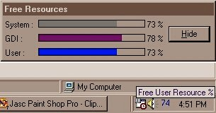



## A Resource Meter

### Description

Resource Meter: It shows

How to

1) Get information on free system resources.

2) Make an Icon from a bitmap at run time.

3) Place an Icon to Task Bar.

4) Make a Custom progress bar.
 
### More Info
 

             |
---                |---
**Submitted On**   |2001-11-14 04:04:56
**By**             |[Saifudheen A A](https://github.com/Planet-Source-Code/PSCIndex/blob/master/ByAuthor/saifudheen-a-a.md)
**Level**          |Intermediate
**User Rating**    |5.0 (10 globes from 2 users)
**Compatibility**  |VB 5\.0, VB 6\.0
**Category**       |[Windows System Services](https://github.com/Planet-Source-Code/PSCIndex/blob/master/ByCategory/windows-system-services__1-35.md)
**World**          |[Visual Basic](https://github.com/Planet-Source-Code/PSCIndex/blob/master/ByWorld/visual-basic.md)
**Archive File**   |[A\_Resource3517311142001\.zip](https://github.com/Planet-Source-Code/saifudheen-a-a-a-resource-meter__1-28832/archive/master.zip)

